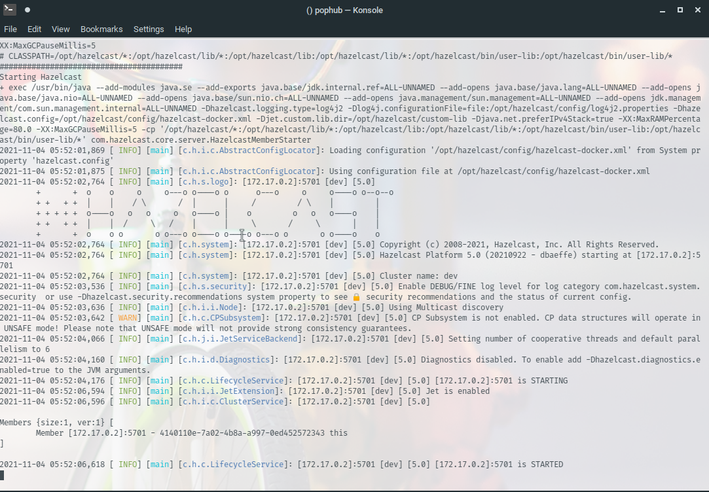

# spring-feature-sample

A sample incubator application that makes use of API first driven development (contract first) using swagger for code generation.

## Requirements

- Spring Boot 2.5.6
- OpenJDK 11+
- Hazelcast
- Docker

> N.B. Any distribution of java 11 will work just as well

## Getting started

Refer to [swagger codegen plugin](https://github.com/swagger-api/swagger-codegen/blob/3.0.0/modules/swagger-codegen-maven-plugin/README.md) for any configuration details

```sh
./mvnw clean compile
./mvnw spring-boot:run
```

### Configuration

To activate a profile, by adding the following line in **Run/Debug** configuration program arguments:

```shell
--spring.profiles.active="staging"
```

### HazelCast

Pull the latest version of hazel cast from dockerhub and start it.
```sh
docker pull hazelcast/hazelcast
docker run --memory 2g --rm hazelcast/hazelcast:5.0
```
After doing the above you should see a similar output:


> For more configuration options see: [Configuration](https://docs.hazelcast.com/hazelcast/5.0/deploy/installing-using-docker)